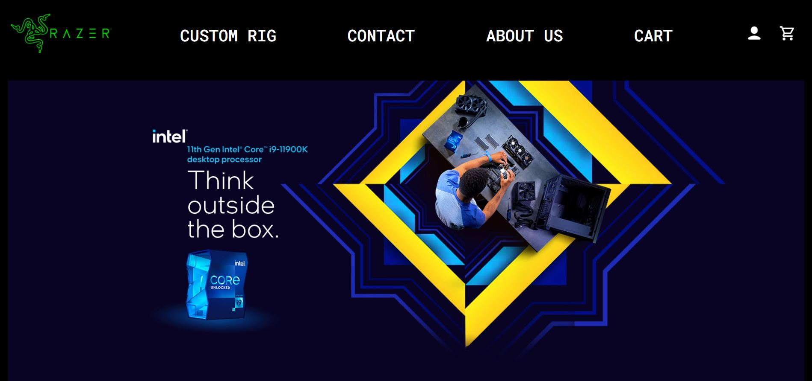
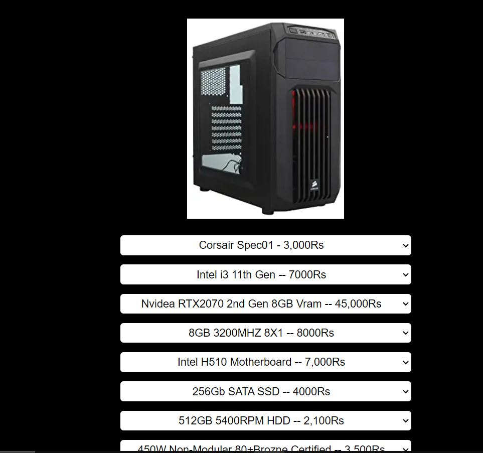
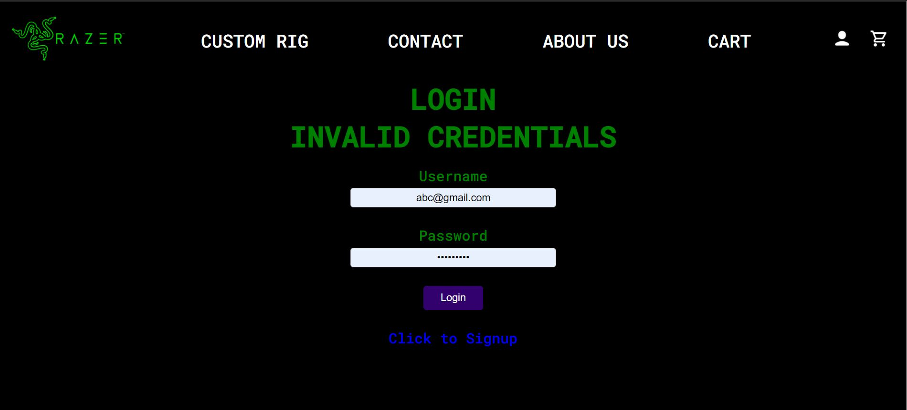

# PC Building Website

A full-stack web application where users can browse PC components, build custom rigs, and place orders. Includes an admin panel for managing users, orders, inventory, and contact messages.

**Note:** This is a demo/portfolio project.

---

## Features

### User side
- **Browse components** – Categories in a sidebar (CPU, GPU, RAM, storage, PSU, etc.) with search and filters (in stock, price range)
- **Product details** – View specs, description, and images; add items to your build
- **Custom PC builder** – Add parts to a build, view cart, update quantities
- **User account** – Sign up, login (password hashing), dashboard, order history, saved builds
- **Checkout** – Place order with payment method (COD / online)
- **Contact** – Contact form with messages stored for admin

### Admin panel
- **Dashboard** – User count, order count, quick links
- **Manage Users** – List users, search by email/name/phone/city, view & edit profile, **ban/unban**, **delete user**
- **Manage Orders** – List orders, view build details, mark complete
- **Contact Messages** – View messages, add notes, set status
- **Components** – Browse by category, add/edit/delete components (with image upload, stock, specs)
- **Search inventory** – Global search across all component tables

---

## Tech stack

- **Backend:** PHP (sessions, MySQLi)
- **Database:** MySQL
- **Frontend:** HTML, CSS (custom), JavaScript (minimal)
- **Font:** Roboto Mono

---

## Prerequisites

- [XAMPP](https://www.apachefriends.org/) (or any stack with Apache + PHP + MySQL)
- PHP 7.4+ with MySQLi
- MySQL 5.7+ / MariaDB

---

## Installation

### 1. Clone the repository

```bash
git clone https://github.com/YOUR_USERNAME/PC-Building_Website-PHP.git
cd PC-Building_Website-PHP
```

### 2. Set up the server

- Place the project folder inside your web server document root (e.g. XAMPP `htdocs`):
  - **XAMPP:** `C:\xampp\htdocs\PC-Building_Website-PHP-main\`
- Start **Apache** and **MySQL** from the XAMPP Control Panel.

### 3. Create the database

1. Open **phpMyAdmin** (e.g. http://localhost/phpmyadmin).
2. Create a new database named `wp_project` (or use another name and update the config in step 5).
3. Import the base schema and data:
   - Import **`wp_project.sql`** into `wp_project`.

### 4. Run migrations (required for latest codebase)

**Option A – One file (recommended)**  
Import **`migration_all_latest.sql`** once. It applies all schema changes needed for the current codebase (user role & banned, component stock/images/specs, builds, build_items, contact_messages, order_id link). If you already ran some migrations, you may see "Duplicate column" errors for those parts—you can ignore them.

**Option B – Individual migrations**  
If you prefer to run them separately, use this order:

| File | Purpose |
|------|--------|
| `database_migration.sql` | User role; component stock, image_url, description, specs; `builds` & `build_items` tables |
| `migration_user_banned.sql` | `banned` column on `user` (admin ban/unban) |
| `migration_contact_messages.sql` | `contact_messages` table |
| `migration_order_build_link.sql` | `order_id` on `builds` (link orders to builds in admin) |

**Optional:** **`seed_components_100.sql`** – Inserts 100 sample components (run after migrations).

### 5. Configure database connection

Edit **`connect_database.php`** if needed:

```php
define('DB_SERVER', 'localhost');
define('DB_USERNAME', 'root');
define('DB_PASSWORD', '');      // Your MySQL password
define('DB_NAME', 'wp_project'); // Your database name
```

### 6. Access the site

- **Website:** `http://localhost/PC-Building_Website-PHP-main/home.php` (adjust path if your folder name differs)
- **Admin panel:** `http://localhost/PC-Building_Website-PHP-main/admin_login.php`

**Default admin login:**  
- Username: `admin`  
- Password: `password123`  

*(Change these in `admin_login.php` for production.)*

---

## Project structure (main files)

```
├── home.php              # Homepage
├── components.php        # Browse components (sidebar, filters, grid)
├── component_detail.php  # Product detail page
├── cart.php              # Cart / build summary
├── placeorder.php        # Checkout
├── login.php / signup.php
├── dashboard.php         # User dashboard
├── my_builds.php         # User's saved builds
├── order_history.php
├── contact.php
├── config/
│   └── categories.php    # Component categories & table mapping
├── includes/
│   └── admin_sidebar.php
├── styles/               # CSS (admin.css, components.css, etc.)
├── images/
├── wp_project.sql           # Base database schema & data
├── migration_all_latest.sql # All migrations in one file (run after wp_project.sql)
├── database_migration.sql   # (or use individual migration_*.sql files)
├── migration_*.sql
└── seed_components_100.sql # Optional: 100 sample components
```

---

## Design previews

| Page | Preview |
|------|--------|
| Home |  |
| Components / options |  |
| Login |  |

---

## License

This project is for educational/demo purposes. Use and modify as you like.

---

## Contributing

Feel free to open issues or submit pull requests if you want to suggest improvements.
